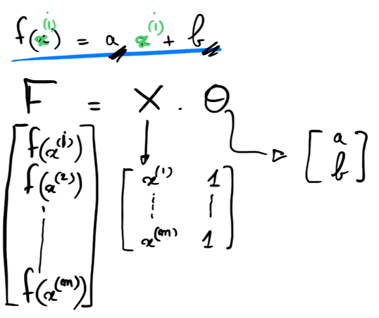

# ft_linear_regression
The aim of this project is to introduce us to the basic concept behind machine learning. For this project, we will have to create a program that predicts the price of a car by using a linear function train with a gradient descent algorithm.

## Getting the datas

First, we get the data form the csv file, that we store in a list of lists

## The model

The linear regression is used to find a linear relationship between a dependant variable (here the mileage of the car) and an independent variable (the price of the car). Since it gives us a line, it will be defined as:
	$$f(x) = a.x + b$$

## The cost function (Mean Squared Error)

$$ J(a, b) = 1/2m\sum_{i=1}^m(ax^{(i)}+b-y^{(i)})^2 $$

The cost function represents the difference between the predicted value and the actual value. The goal is to minimize this difference.
Here, $m$ is the number of samples, $\Sigma$ is the sum of the differences between the predicted value and the actual value, squared to avoid negative values, on all the samples.

## The gradient descent algorithm

The result of the cost function is a parabola, and the goal is to find the minimum of this parabola, which corresponds to the minimal error between the predicted value and the actual value.
The gradient descent algorithm is used to find this minimum. It is based on the derivative of the cost function, which gives us the slope of the curve at a given point. The goal is to find the point where the slope is equal to 0, which is the minimum of the curve.


This will be applied to $a$ and $b$, in our case, $\theta_0$ and $\theta_1$

Calculation of a gradient for $a$ and $b$:

$$\frac{\partial J}{\partial a} = 1/m \sum_{i=1}^mx(ax^{(i)}+b - y^{(i)})$$

$$\frac{\partial J}{\partial b} = 1/m \sum_{i=1}^m(ax^{(i)}+b - y^{(i)})$$

We will use a random starting point (0 for us), and we will update the value of $a$ and $b$ by advancing with a constant step $\alpha$ (learning rate) in the direction of the slope. We'll do this until the slope is equal to 0.

$$a_{i+1} = a_i - \alpha \frac{\partial J}{\partial a}$$


## Using matrix calculations

So to avoid multiple calculations, we can use matrix multiplication, which will apply a formula to all the samples at once. This will allow us to calculate the cost function and the gradient descent algorithm much faster.

To apply to all elements **(i)**, we can represent the model as follow:




Our model is now defined as:

$$f(X) = X . \theta$$

Where $X$ is a matrix of the samples **(m x 2)**, and $\theta$ is a matrix of the parameters $a$ and $b$ **(2 x 1)**. So our $X.\theta$ is now a matrix of **(m x 1)**.

Reminder about a matrix multiplication:


Now, to replace the $-y^{(i)}$ of our model with a matrix, and since $X.\theta$ is **(m x 1)**, we put all the values in an array, which also gives a matrix of **(m x 1)**.

So now our model is like this:

$$J(\theta) = 1/2m\sum(X.\theta - Y)^2$$

Now to calculate the gradients with matrix, we put our $a$ and $b$ gradients calculations in a vector.

$$\frac{\partial{J\theta}}{\partial{\theta}} = \frac1m X^T(X.\theta - Y)$$

Where $X^T$ is the transpose of $X$, meaning we inverted its dimensions.
That formula will calculate all the derived of $J$ for each $\theta$.
 
## Normalizing the data

In machine learning, normalizing the datas is ranging multple datasets on a same scale (between 0 and 1 mostly), so the datasets have the same weight.
Here, our price and mileage datas are quite similar (thousands to hundred thousands), but it can be way worse (0,00001 compared to 10000000 for example).
With linear regression application, normalizing datas is not important, but it is when using gradient descent algorithm, it accelerates the finding of the minimal error.


$$X_{normalized} = \frac{X-\mu}{\sigma} $$
With $X$ the array of values, $\mu$ the mean of the array, and $\sigma$ the standard deviation (ecart type).

## Numpy on matrix

Numpy is a library that allows us to work with arrays and matrices. It is very useful for linear algebra operations, and it is very efficient for large datasets.
To declare a matrix, we can use the following syntax (define a matrix in capital letter):

```python
# matrix 2x3
A = np.array([[1, 2], [3, 4], [5, 6]])

A.shape() # gives the dimensions of the matrix
(2, 3)

A.T # gives the transpose of the matrix
(3, 2)

B = np.ones((3, 1)) # matrix 3x1 filled with 1

np.dot(A, B) # gives the matrix multiplication of A and B
#Note: The A.y factor and the B.x factor must be the same !!!
```

## Ressources

https://www.youtube.com/@MachineLearnia/videos

https://www.geeksforgeeks.org/graph-plotting-in-python-set-1/

https://numpy.org/doc/stable/reference/index.html

https://matplotlib.org/stable/users/index

https://dilipkumar.medium.com/linear-regression-model-using-gradient-descent-algorithm-50267f55c4ac